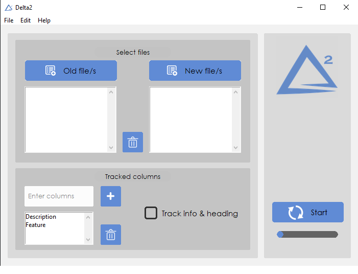

# Delta2

Tool for finding and highlighting differences between excel files 




## Setup using packed installer

1. Get the latest [release](https://github.com/necator9/Delta2/releases) of `Delta2_setup.exe`.
2. The installer will install the `run_delta2.exe` into desired location and create a shortcut on the desktop.


## Running as python file

1. Install requirements

```
pip install -r requirements.txt
```

2. Run the script

```
python run_delta2.py
```

## Assembling in a python bundle

1. Pack to run_delta2.exe

```
pyinstaller run_delta2.py --distpath InnoSetup/dist --noconsole --add-data="images;images" --icon=InnoSetup\delta.ico
```

2. Run run_delta2.exe from `InnoSetup\dist\run_delta2\run_delta2.exe`

## Packing in an installer

1. Asseble a python bundle first
2. Install [Inno Setup](https://jrsoftware.org/isinfo.php)
3. Change directory and open `delta2\InnoSetup\Inno_setup_script.iss` with InnoSetup
4. Run build
5. The packed installer is located in `delta2\InnoSetup\dist\Delta2_setup.exe`
